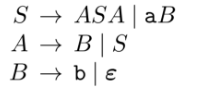
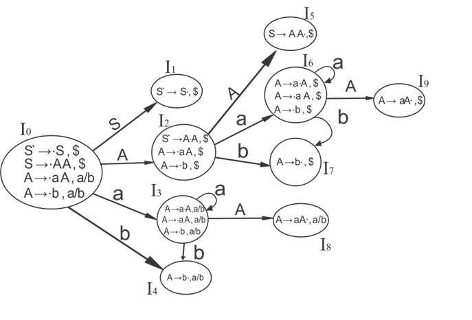
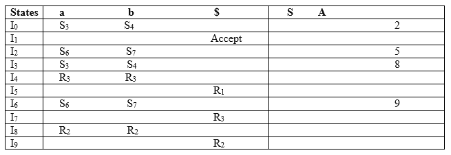
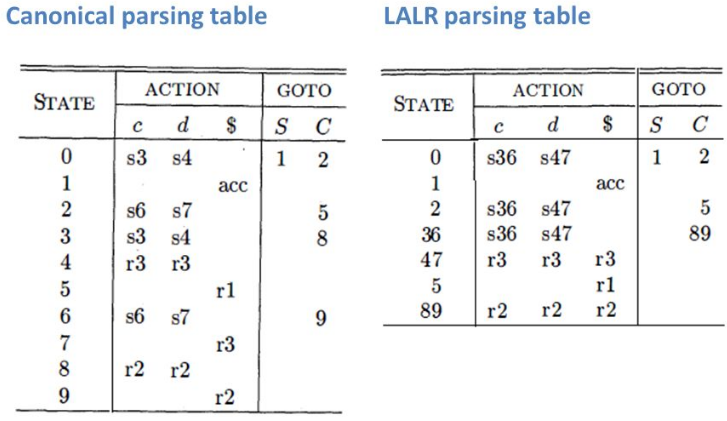
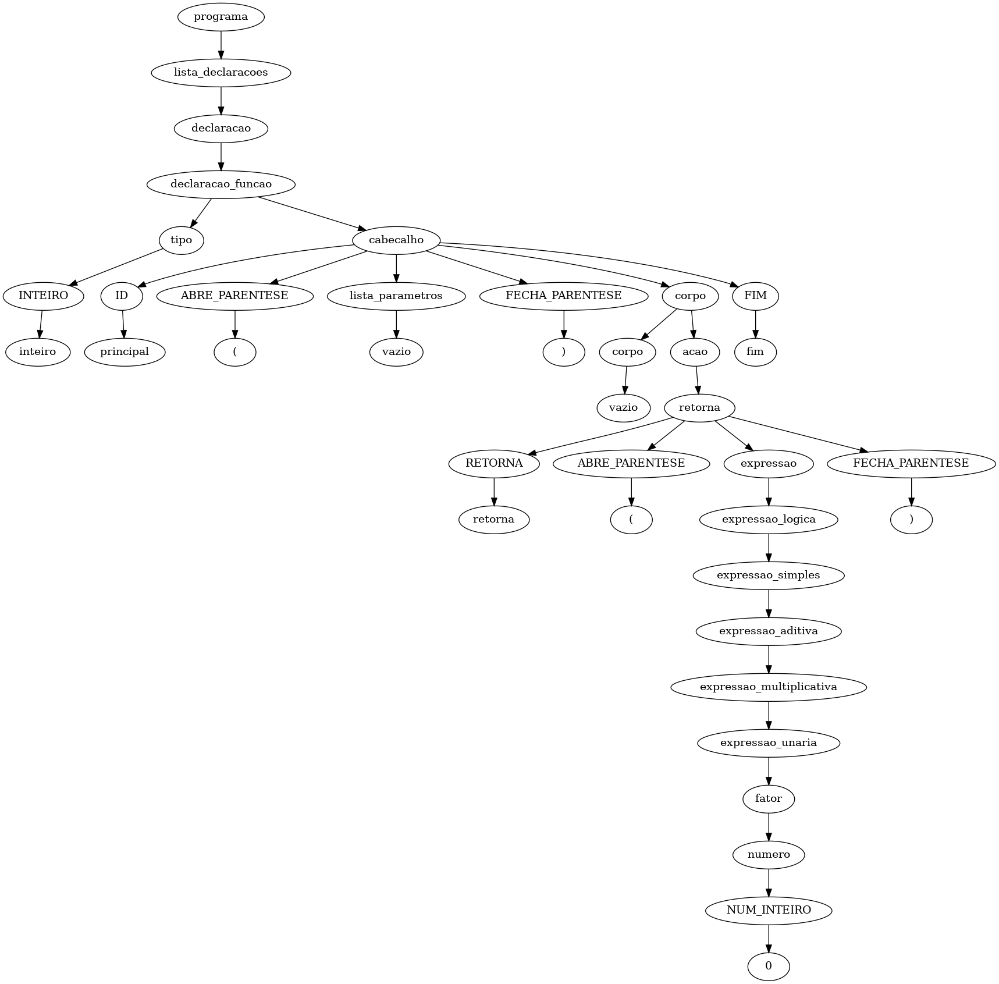
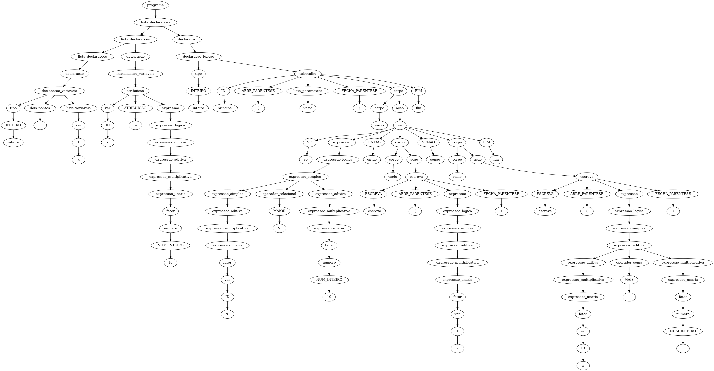

# **Implementação de um Compilador para a linguagem TPP: Análise Sintática**

### **Caio L. A. Miglioli**

### Departamento de Computação - Universidade Técnologica Federal do Paraná, Campus Campo Mourão.

### caiomiglioli@gmail.com

***Resumo.*** Este trabalho tem como objetivo desenvolver um programa de análise sintática para a linguagem TPP. Para isso foi utilizado o PLY-Yacc, uma ferramenta que utiliza um autômato com pilha em conjunto com gramáticas livre de contexto para associar tokens retirados do código fonte à regras gramaticais passíveis de serem interpretadas em uma parte futura do processo de compilação. Foi então definido a gramática para a linguagem TPP e desenvolvido um programa Yacc, que, ao terminar análise, gera uma árvore sintática que pode ser usado para estipular a precedência das regras a serem interpretadas. 

## **1. Introdução**
O processo de implementação de um compilador para uma linguagem pode ser divida em quatro grandes partes: A análise léxica, a análise sintática, a análise semântica e a geração de código. Cada uma dessas partes possuem teorias complexas e distintas para que se resolvam os problemas levantados.

Na análise sintática, buscamos dar sentido à sequência de tokens adquiridos na análise léxica, encaixando-as em regras sintáticas de forma à criar uma árvore que corresponderá a ordem em que os tokens devem ser resolvidos em uma parte futura do compilador.

Para associar uma cadeia de tokens à alguma regra sintática, utilizamos o módulo Yacc da biblioteca PLY para Python. Este módulo utiliza o algoritmo LALR para gerar um autômato (em forma de tabela) a partir de uma linguagem livre de contexto. Tal autômato é utilizado para definir se a cadeia de tokens é redutível para alguma regra gramatical da linguagem, e por fim, utilizando um autômato com pilha, é criado uma árvore sintática onde a raíz corresponde ao símbolo de início, as folhas correspondem aos tokens léxicos e cada nível da árvore corresponde à uma regra gramatical (produção intermediária).

## **2. A ferramenta Yacc**

O Yacc (Yet another compiler-compiler) é uma ferramenta de geração de compiladores que realiza a análise sintática. Neste trabalho foi utilizado uma implementação em Python desta ferramenta, o PLY, desenvolvida por David M. Beazley.

O PLY-Yacc submete automaticamente os tokens gerados por uma ferramenta Lex à um autômato com pilha utilizando o método de Shift-Reduce do algoritmo LALR, onde o algoritmo verifica se é possivel reduzir os tokens ou simbolos já empilhados em uma regra gramatical dada pela linguagem livre de contexto definida. Caso contrário, o algoritmo invoca mais um token, e tenta novamente. Se ao final, houver apenas o simbolo de início, o código fonte é aprovado.

Para que o Yacc possa identificar a cadeia de simbolos, precisamos definir funções contendo as regras gramaticais, essas regras não devem ser ambíguas e nem conter loops. E devem seguir o padrão a seguir e ilustrado no código 1.

* O nome da função deve ser exatamente igual ao simbolo que será gerado.
* O nome da função deve conter o prefixo 'p_'.
* Entre parenteses triplo deve haver uma regra gramatical livre de contexto em formato BNF.
* Código extra para realização de atividades extras.

```
def p_declaracao(p):
    """declaracao : declaracao_variaveis
                | inicializacao_variaveis
                | declaracao_funcao
    """
    pai = MyNode(name='declaracao', type='DECLARACAO')
    p[0] = pai
    p[1].parent = pai
```
##### **Código 1:** Exemplo de função para o Yacc.

### **2.1. Linguagens livres de contexto**

Uma linguagem livre de contexto é o resultado de todas as derivações possíveis geradas por uma gramática livre de contexto, ou seja, podemos escrever qualquer algoritmo em C pois C é uma linguagem, mas todos os códigos em C devem respeitar um certo modo para ser escrito, esse modo é a gramática.

Na teoria das linguagens, a gramática livre de contexto é escrita seguindo a forma exibida na imagem 1, onde os simbolos terminais (letras minúsculas e epsilon) significam que a derivação termina por ali, e os simbolos não terminais (letras maiúsculas) devem ser derivados até que se chegue a um terminal. 

Por consequência, somente o que for possível derivar a partir da gramática, faz parte da linguagem. Isto é um atributo muito útil para se desenvolver um compilador, pois é o que define o que são expressões válidas, e o que é um erro de sintaxe. No código 2 temos, em formato BNF uma gramática livre de contexto que aceita expressões matemáticas simples.



**Figura 1:** Autômato finito para a número flutuante.

```
expression : expression + term
            | expression - term
            | term
 
 term       : term * factor
            | term / factor
            | factor
 
 factor     : NUMBER
            | ( expression )
```
##### **Código 2:** Exemplo de gramática livre de contexto que aceita expressões matemáticas simples. (Fonte: Dabeaz)

### **2.1.1. Formato BNF**

A formalidade de Backus-Naur (BNF) é um formato para expressar gramáticas livre de contexto.

O formato segue o padrão <mark><símbolo> ::= <expressão com símbolos></mark>. Onde <mark><símbolo></mark> indica um não terminal, e a <mark><expressão com símbolos></mark> índica as derivações que o símbolo em questão pode ter. Tais derivações podem conter vários símbolos e terminais, e também pode haver mais de uma derivação possível, indicada a opção utilizando o caractere "|". Um exemplo de uma gramática em BNF pode ser vista no código 3.

```
declaracao ::= declaracao_variaveis | inicializacao_variaveis | declaracao_funcao
```
##### **Código 3:** Exemplo de gramática gramática em BNF.


### **2.2. Autômatos com pilha**

Uma máquina de estados comum define sua ação com base no símbolo recebido e em seu estado atual. Um autômato com pilha, por sua vez, define sua ação utilizando uma variável a mais: O símbolo no topo da pilha. Um autômato com pilha, ao receber um novo símbolo, pode tomar algumas ações diferentes, como consumir o símbolo recebido, tomar outra ação com base no conjunto de símbolo recebido, estado atual e símbolo do topo da pilha, como pode também consumir o símbolo do topo da pilha. 

Ao considerar que cada símbolo pode ser um token de uma palavra identificada na análise léxica ou um símbolo composto de vários tokens, a capacidade do autômato com pilha de olhar para o que veio antes torna-se muito útil para que possamos combinar multiplos tokens assim que os recebemos, transformando, por exemplo, um token 'NUMBER', um token 'OP_SOMA' e outro token 'NUMBER' em um símbolo 'expressao_adicao'.

A partir dessa propriedade e utilizando a gramática livre de contexto para definir as regras do autômato, surge um sistema muito eficiente para a realização da análise sintática. Método este que é utilizado desde a metade do século passado, e que é implementado pelo Yacc e utilizado neste trabalho.

### **2.3. O algoritmo LALR(1)**

O algoritmo utilizado pelo PLY-Yacc nesse trabalho é o LALR(1), que, a partir das regras gramaticais, gera um autômato de estados finitos e uma tabela de transições shift/reduce. Tabela esta que será utilizada pelo autômato com pilha para determinar se um conjunto de símbolos deve ser reduzido à um simbolo único (reduce) ou se deve esperar o próximo símbolo (shift).

O algoritmo LALR(1) é uma otimização do CLR(1), sua diferença se dá na junção de estados similares, criando super-estados que representam os anteriores. Quando estamos lidando com máquinas de estado grandes, essa otimização se traduz em velocidade, menor uso de recursos e maior eficiência da tradução.

O CLR(1), por sua vez, é um algoritmo de análise sintática ascendente com lookahead, ou seja, é executada uma verificação do token que virá após o token que o algoritmo está lendo no momento da análise. Para que se possa fazer a análise, o CLR(1) gera um autômato finito a partir das regras gramaticais. O formato das transições do CLR(1) se dá pela definição <mark> [simbolo] -> [simbolo lido] . [continuação do simbolo] , [lookahead]</mark>, onde o lookahead deve sempre ser o próximo terminal derivável da produção que está sendo analisada, por exemplo: <mark>A -> a.A, a|b</mark>.

No CLR(1) todas as possíveis derivações determinada pela definição serão transformadas em estados, exceto as derivações da <mark>[Continuação do símbolo]</mark>, estas transformações fazem parte do estado da regra que o gerou. Uma exemplificação disso pode ser visualizada na máquina de estados da Figura 2.



##### **Figura 2:** Autômato finito produzido pelo CLR(1) (Fonte: JavaTPoint).

A máquina de estados produzida pelo CLR(1) é então convertida para uma matriz que será utilizada pelo PLY para realizar a análise. Essa matriz contém uma linha para cada estado, uma coluna de ações Shift/Reduce com sub-colunas para cada terminal e uma coluna de transições (GoTo) para os símbolos não terminais. Um exemplo pode ser visto na Figura 3. 



##### **Figura 3:** Tabela gerada a partir do autômato finito produzido pelo CLR(1) (Fonte: JavaTPoint).

Por fim, para implementar o algoritmo LALR(1), tudo que se precisa fazer é unificar os estados semelhantes: aqueles estados em que todas as suas produções são iguais, mas os lookaheads podem ser diferentes. Para isso, para cada produção semelhante, basta adicionar o operador lógico | (ou) ao final, seguido dos lookaheads da produção que se pretende unificar. O funcionamento do algoritmo continuará o mesmo. 

Na prática, isto é feito direto na tabela, criando novos estados e removendo os antigos, por exemplo, se tinhamos dois estados X e Y, teremos o estado XY. Um exemplo disto pode ser visto na Figura 4.



##### **Figura 4:** Tabela LALR(1) gerada a partir da tabela CLR(1) (Fonte: SlidePlayer/Elwin Watson).

## **3. Implementação**

Com a teoria estabelecida, a implementação fica mais fácil, pois devido ao uso do PLY-Yacc, todo o processo é automatizado e ocorre "por baixo dos panos", precisamos apenas definir a gramática da linguagem.

Mas, assim como na análise léxica foi gerado uma lista de tokens a partir do código fonte, na análise sintática precisamos gerar um produto que possa ser consumido nas fases seguintes. Este produto é a Árvore Sintática.

### **3.1. Regras Gramaticais**

Para que se possa gerar a árvore sintática da linguagem TPP, é necessário definir a sintaxe da linguagem, fazemos isso definindo as regras gramaticais utilizando o conceito de Linguagens Livres de Contexto e notação BNF. É importante que elas não sejam ambíguas ou levem à recursões infinitas, mas tais problemas podem ser verificados pela própria ferramenta Yacc. As produções da gramática da linguagem TPP podem ser vistas na tabela 1.

| Produções da Linguagem TPP |
|------------------------|
| programa ::= lista_declaracoes
| lista_declaracoes ::= lista_declaracoes declaracao \| declaracao
| declaracao ::= declaracao_variaveis \| inicializacao_variaveis \| declaracao_funcao
| declaracao_variaveis ::= tipo ":" lista_variaveis
| inicializacao_variaveis ::= atribuicao
| lista_variaveis ::= lista_variaveis "," var \| var
| var ::= ID \| ID indice
| indice ::= indice "[" expressao "]" \| "[" expressao "]"
| tipo ::= INTEIRO \| FLUTUANTE
| declaracao_funcao ::= tipo cabecalho \| cabecalho
| cabecalho ::= ID "(" lista_parametros ")" corpo FIM
| lista_parametros ::= lista_parametros "," parametro \| parametro \| vazio
| parametro ::= tipo ":" ID \|  parametro "[" "]"
| corpo ::= corpo acao \| vazio 
| acao ::= expressao \| declaracao_variaveis \| se \| repita \| leia \| escreva \| retorna \| erro
| se ::= SE expressao ENTAO corpo FIM \| SE expressao ENTAO corpo SENAO corpo FIM
| repita ::= REPITA corpo ATE expressao
| atribuicao ::= var ":=" expressao
| leia ::= LEIA "(" var ")"
| escreva ::= ESCREVA "(" expressao ")"
| retorna ::= RETORNA "(" expressao ")"
| expressao ::= expressao_logica \| atribuicao
| expressao_logica ::= expressao_simples \| expressao_logica operador_logico expressao_simples
| expressao_simples ::= expressao_aditiva \| expressao_simples operador_relacional expressao_aditiva
|expressao_aditiva ::= expressao_multiplicativa \| expressao_aditiva operador_soma expressao_multiplicativa
| expressao_multiplicativa ::= expressao_unaria \| expressao_multiplicativa operador_multiplicacao expressao_unaria
| expressao_unaria ::= fator \| operador_soma fator \| operador_negacao fator
| operador_relacional ::= "<" \| ">" \| "=" \| "<>" \| "<=" \| ">="
| operador_soma ::= "+" \| "-"
| operador_logico ::= "&&" \| "||"
| operador_negacao ::= "!"
| operador_multiplicacao ::= "*" \| "/"
| fator ::= "(" expressao ")" \| var \| chamada_funcao \| numero
| numero ::= NUM_INTEIRO \| NUM_PONTO_FLUTUANTE \| NUM_NOTACAO_CIENTIFICA
| chamada_funcao ::= ID "(" lista_argumentos ")"
| lista_argumentos  ::= lista_argumentos "," expressao \| expressao \| vazio

##### **Tabela 1:** Produções em BNF da linguagem TPP.

### **3.2. Implementação utilizando o Yacc**

A implementação pela ferramenta PLY-Yacc também é algo simples, basta criar funções para cada símbolo, e informar as produções que tal símbolo pode derivar, não é necessário inserir uma lista de símbolos como os tokens do PLY-Lex.

As funções do PLY-Yacc devem seguir o modelo especificado no capítulo 2 deste trabalho e exemplificadas no Código 1. E desta forma, para cada produção especificada na Tabela 1, é criada uma função no analisador léxico.

Uma das principais funções de um compilador é a detecção de erros no código fonte, uma boa mensagem de aviso deixa claro para o desenvolvedor onde o erro foi detectado, facilitando a sua correção. No precesso de análise, quando o autômato no Yacc tenta ir para um estado não especificado pela tabela LALR(1), é gerado um símbolo "error" que é captado pela função <mark>p_error</mark>, esta função é capaz de dizer em qual linha aconteceu o erro e qual o símbolo anterior ao erro, mas não é capaz de identificar o tipo do erro, para isso, precisamos captá-los manualmente.

Para que podemos captar erros manualmente, precisamos definir uma função de erro para cada produção da gramática. Tais funções seguem o mesmo formato das produções normais, mas como convenção inserimos o sufixo <mark>_error</mark> no cabeçalho. A grande diferença está na BNF da função, onde substituímos símbolos não terminais pelo símbolo <mark>error</mark>. Uma exemplificação disso pode ser vista no Código 4.

```
def p_se(p):
    """se : SE expressao ENTAO corpo FIM
          | SE expressao ENTAO corpo SENAO corpo FIM
    """
    # [...] código referente a árvore sintática


def p_se_error(p):
    """se : error expressao ENTAO corpo FIM
        | SE expressao error corpo FIM
        | SE expressao ENTAO corpo
        | error expressao ENTAO corpo SENAO corpo FIM
        | SE expressao error corpo SENAO corpo FIM
        | SE expressao ENTAO corpo error corpo FIM
        | SE expressao ENTAO corpo SENAO corpo
    """
    errorMsg(p.lineno(1), "Se-Então: Expressão inválida ou declaração incompleta")
```
##### **Código 3:** Função do PLY-Yacc para detectar a produção "se" e tratar seu caso de erro.

um uso interessante da captação de erros manuais pode ser notato no código 3, onde é possível detectar o erro de símbolo faltante, algo que o p_error() é incapaz de detectar. 

### **3.3. Árvore Sintática**

Cada função para um símbolo detectado pelo Yacc contém um trecho de código extra para que o desenvolvedor possa determinar o que o programa deve fazer se encontrado tal símbolo. Nesse caso, utilizamos esse trecho para criar uma árvore sintática (um exemplo pode ser visto na figura 5) utilizando a biblioteca para python AnyTree.



**Figura 5:** Exemplo de árvore sintática.

Nessa árvore, o código fonte deve estar nas folhas e deve estar conectado a um nó superior que corresponde à alguma regra sintática no qual cada token está associado. Cada nó intermediário, por sua vez, pode conter como filho tanto um terminal (folha) quanto outro nó intermediário que corresponde à outra regra. Tais nós serão criados quando o autômato com pilha do Yacc reduzir um conjunto de símbolos em uma regra sintática (Exemplo no Código 4).

```
#** função a ser chamada pelo Yacc ao reduzir
#** tokens para a regra 'declaracao de variaveis
#** p é um vetor contendo todos os símbolos que serão reduzidos
#** p[0] = declaracao_variaveis
#** p[1] = tipo
#** p[2] = DOIS_PONTOS
#** p[3] = lista_variaveis

def p_declaracao_variaveis(p):
    """declaracao_variaveis : tipo DOIS_PONTOS lista_variaveis"""

    #** Cria um nó intermediario cujo nome é 'declarao_variaveis'
    pai = MyNode(name='declaracao_variaveis', type='DECLARACAO_VARIAVEIS')
    
    #** Associa o nó intermediario com o símbolo para que se possa ter
    #** acesso futuramenta (em outra regra) à esse nó.
    p[0] = pai

    #** Associa o nó 'declaracao_variaveis' como nó pai do símbolo 'tipo'
    p[1].parent = pai

    #** Símbolo terminal (Token direto do código fonte)
    #** Cria um nó contendo o símbolo a regra 'DOIS_PONTOS' cujo pai é 'declaracao_variaveis'
    filho = MyNode(name='dois_pontos', type='DOIS_PONTOS', parent=pai)

    #** Cria um nó contendo o token ':' e associa como filho do nó 'DOIS_PONTOS'
    filho_sym = MyNode(name=p[2], type='SIMBOLO', parent=filho)
    p[2] = filho

    #** Associa o nó 'declaracao_variaveis' como nó pai do símbolo 'lista_variaveis'
    p[3].parent = pai
```
##### **Código 4:** Função do PLY-Yacc para tratar a produção "declaracao de variaveis".


A árvore se dá como correta caso seja possível unificar todos os nós por meio de regras que eventualmente possam ser reduzidas na regra <mark>programa</mark>, que deve ser o nó raíz (Código 5).

```
def p_programa(p):
    """programa : lista_declaracoes"""

    #** determina que este deve ser a raíz da árvore
    global root

    programa = MyNode(name='programa', type='PROGRAMA')

    root = programa
    p[0] = programa
    p[1].parent = programa
```
##### **Código 5:** Função do PLY-Yacc para tratar a produção do nó raíz "programa".

Com todo esse processo construído, teremos uma abstração das regras sintáticas de um arquivo TPP capaz de ser utilizado na próxima fase (análise semântica), e podemos também, para meios de informação, imprimir uma imagem contendo a árvore construída durante o processo de análise sintática.


## **Execução**

Para testar a execução do programa, utilizamos um código fonte simples contendo um erro de fechamento (fim). A ideia é tentar descobrir, através das mensagens de erro, o que há de errado com o código fonte, e depois corrigí-lo a fim de gerar a árvore sintática correta ao final.

O código fonte contém uma declaração de variável, uma atribuição de váriavel, a função principal, uma expressão se-então e a chamada da função interna 'escreva', o código pode ser visto no código 6 e sua saída no código 7.

```
inteiro: x

x := 10

inteiro principal()
	se x > 10 então
		escreva(x)
	senão
		escreva(x + 1)
		
fim
```
##### **Código 6:** Código fonte de teste contendo um erro no fechamento da expressão Se-Então.

```
Generating LALR tables
WARNING: 93 shift/reduce conflicts
WARNING: 53 reduce/reduce conflicts
WARNING: reduce/reduce conflict in state 185 resolved using rule (atribuicao -> error ATRIBUICAO expressao)
WARNING: rejected rule (atribuicao -> ATRIBUICAO expressao) in state 185
WARNING: reduce/reduce conflict in state 187 resolved using rule (expressao_unaria -> fator)
WARNING: rejected rule (expressao_unaria -> operador_soma fator) in state 187
ERRO: Linha 5: Violação detectada em 'Cabeçalho de Função: Cabeçalho inválido ou incompleto.'.
Não foi possível continuar a compilação: A análise sintática falhou...
```
##### **Código 7:** Saída do programa ao tentar analisar o código fonte do Código 6.

A saída nos dá indícios do que o PLY-Yacc executou. A primeira linha nos diz que o Yacc criou o autômato e gerou a tabela de shift-reduce do LALR. As próximas 6 linhas contém avisos de inconsistência gerados pela definição das regras gramaticais, sendo as duas primeiras nos informando a quantidade de conflitos shift/reduce e reduce/reduce que existem (conflitos estes que o Yacc resolve automaticamente). Já os outros dois tipos de avisos, o reduce/reduce e rejected rule, nos dizem sobre os conflitos que ocorreram na análise sintática. Tais avisos andam juntos: O primeiro nos diz que houve um conflito no autômato e nos diz em qual estado (state 185 e 187) e o segundo nos diz qual foi a regra preterida em cada conflito.

Por fim, temos uma mensagem de erro. Esta mensagem é executada quando o Yacc executa uma função de erro, como aquelas que foram desenvolvidas manualmente. Neste caso foi chamada a regra <mark>p_declaracao_funcao_error(p)</mark> pois detectou que a função principal não finaliza com o token "fim".

Podemos observar neste caso de erro duas coisas interessantes: A primeira é que o analisador entendeu que o token "fim" faz parte da regra se-então, chamando a função de erro do cabeçalho. E a segunda é que este caso foi detectado por uma função de erro manual, que não contém o token "error" gerado pelo Yacc, mostrando a importância dessa funcionalidade.

Por fim, ao corrigir este erro adicionando um segundo token "fim", temos um código correto para o analisador sintático, e então geramos a árvore sintática do Código 6 que pode ser vista na Figura 6.



**Figura 6:** Árvore sintática produzida a partir do Código 6 corrigido.

## **Conclusão**

Muitos dos conceitos utilizados aqui são muito antigos, alguns precedem até a programação de alto nível e outros se quer foram pensados com esse uso como intuito. Árvores, autômatos, linguagens livres de contexto, todos são assuntos tão distantes entre si, que é dificil imaginar a agregação deles formando, com maestria, algo tão útil para o mundo moderno.

A análise sintática por anos foi considerada a parte principal da compilação, e isso refletiu até no nome da ferramenta que utilizamos até hoje, o Yacc. Após desenvolver este trabalho, fica claro o porquê desse fato. O poderío de analisar um código que essa parte possui é tão vasto, que até pra quem não possui base pra entender a implementação, olhando apenas para o resultado, consegue ver o progresso em direção à geração de código de máquina que a análise sintática proporciona.

## **Referências**

**Beazley, D. (2007).** Ply (python lex-yacc).

**Beazley, D. (2007).** Writing parsers and compilers with PLY.

**Louden, K. C. (2004).** In Learning, C. editor, Compiladores: princípios e práticas. 1th edition.

**JavaTPoint (Desconhecido).** CLR (1) Parsing

**Elwin Watson (2015).** Elwin Watson - LESSON 24.