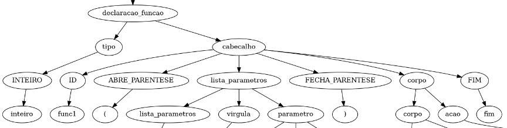
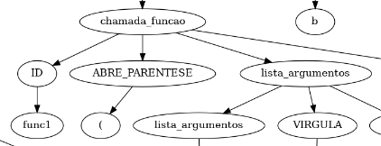
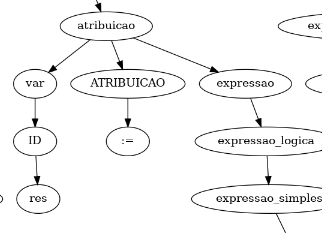

# **Implementação de um Compilador para a linguagem TPP: Análise Semântica**

### **Caio L. A. Miglioli**

### Departamento de Computação - Universidade Técnologica Federal do Paraná, Campus Campo Mourão.

### caiomiglioli@gmail.com

***Resumo.*** Este trabalho descreve a implementação da terceira parte do compilador para a linguagem TPP, a análise semântica. Esta análise busca encontrar erros de contexto no código fonte, que garante o funcionamento correto do produto final. Este documento aborda explicações sobre a falta de uma teoria padrão, a criação de tabelas auxiliares que armazenam informações de variáveis e funções declaradas, e também fala sobre cada uma das sete regras semânticas implementadas. Por fim, descreve como a árvore semântica final foi otimizada e preparada para a geração de código.

## **1. Introdução**
O processo de implementação de um compilador para uma linguagem pode ser divida em quatro grandes partes: A análise léxica, a análise sintática, a análise semântica e a geração de código. Cada uma dessas partes possuem teorias complexas e distintas para que se resolvam os problemas levantados.

Na análise semântica, buscamos encontrar erros de contexto, algo que não é possível detectar através das fases anteriores. Por exemplo, uma atribuição de uma soma de constantes à uma variável sempre será uma regra válida para a análise léxica e sintática, porém, na prática, não há como atribuir um valor à uma variável que nunca foi declarada, ou seja, que não existe. A análise semântica tem como função detectar estes erros de contexto, que nesse caso, é checar se tal variável foi declarada antes da atribuição.

Nesta parte do compilador, podemos dividir em três partes distintas no desenvolvimento: A criação de tabelas auxiliares, detecção de regras semânticas, e a otimização da árvore sintática que será utilizada na parte final.

## **2. A (falta de) Teoria**

Ao contrário das fases anteriores, na semântica não temos um conjunto de teorias para utilizar como base, ficando assim, a mercê do desenvolvedor descobrir o melhor método para detectar os contextos e seus defeitos.

Mas, apesar de não ter um jeito correto, temos alguns métodos quase que unânimes na criação de um compilador, que são as tabelas de variáveis e de funções. Tais tabelas tem como objetivo facilitar a análise das regras semânticas, guardando as informações a respeito de escopo, dimensões, parâmetros, nomes, tipos, e tudo que vier a ser útil no futuro.

## **3. Parte 1: Tabelas Auxiliares**

Para ajudar na análise das regras semânticas, precisamos criar a tabela de funções, que irá guardar informações a respeito de cada função declarada, e a tabela de variáveis, que irá guardar as informações de tipo, escopo, dimensões, e etc de cada variável detectada no código. Exemplos dessas tabelas podem ser vistas na Tabela 1 e Tabela 2.

| TIPO | NOME | PARAMS | L-INICIAL | L-FINAL | UTIL |
|------|------|--------|-----------|---------|------|
 | INTEIRO | func1 | [inteiro, x], [inteiro, y] | 4 | 12 | True
 | INTEIRO | principal | [] | 14 | 22 | True
##### **Tabela 1:** Exemplo de Tabela de funções.

| TIPO | NOME | DIMENSOES | LINHA | ESCOPO | INIT | UTIL |
|------|------|-----------|-------|--------|------|------|
| INTEIRO | a | ['10'] | 1 | global | 16 | True
| INTEIRO | b | [] | 2 | global | 19 | True
| INTEIRO | x | [] | 4 | func1 | 4  |True
| INTEIRO | y | [] | 4 | func1 | 4  |True
| INTEIRO | res | ['x'] | 5 | func1 | 7  |True
| INTEIRO | x | [] | 15 | principal | 17 | True
| INTEIRO | y | [] | 15 | principal | 18 | True
##### **Tabela 2:** Exemplo de Tabela de variáveis.

Podemos iniciar a construção dessas tabelas até na parte léxica do compilador, mas nesse caso, para que tenhamos uma boa divisão e fique mais claro, decidi por desenvolver totalmente separado, a partir da árvore sintática gerada pela fase anterior. A única mudança necessária foi adicionar o atributo 'número de linha' nos nós que referenciavam diretamente o código.

### **3.1. Tabela de Funções**
Para gerar a tabela de funções foi necessário percorrer a árvore analisando os nós 'DECLARACAO_FUNCAO' e 'CHAMADA_FUNCAO'.

No nó DECLARACAO_FUNCAO, foi possível capturar a grande maioria das informações de cada função. Deixando somente a informação de utilização da tabela para ser atualizada pelos nós 'CHAMADA_FUNCAO'. Na imagem 1 temos um exemplo da estrutura de um nó 'DECLARACAO_FUNCAO'.

Um ponto a ser notado aqui é que buscando o atributo 'Linha' do nó folha mais a esquerda (Tipo>Inteiro) e o do nó folha mais a direita (fim), temos o a linha inicial e final da função, que utilizamos na geração da tabela de variáveis para determinar o escopo da variável.

**Figura 1:** Exemplo de nó 'DECLARACAO_FUNCAO'.

### **3.2. Tabela de Variáveis**
A tabela de variáveis é um pouco mais complexa, pois além de depender de informações da tabela de funções, há mais de um tipo de declarar uma variável: Pelo nó 'DECLARACAO_VARIAVEL' e também pela declaração de função.

Aqui, cada parâmetro de uma função é inserido como uma variável que possui a função como escopo. Sua dimensão, caso seja um vetor, tem um valor diferente pois só é detectado em execução, e é automaticamente inicializado, pois é necessário inserir parametros reais para que se possa chamar a função, ou seja, sempre terá uma informação ali.

Já para as declarações normais, conseguimos obter as informações de tipo no nó 'DECLARACAO_VARIAVEIS) (e também o número da linha, e com isso determinar seu escopo), e o nome das variáveis no nó 'LISTA_VARIAVEIS', nó este que em caso de uma multipla declaração, sempre terá um filho chamado 'LISTA_VARIAVEIS' que conterá o nome da próxima variável e um outro nó LISTA_VARIAVEIS (e assim até terminar)

**Figura 2:** Exemplo de nó 'DECLARACAO_VARIAVEIS'.

## **4. Parte 2: Regras Semânticas.**

As regras semânticas implementadas nessa parte foram desenvolvidas conforme a numeração estipulada no enunciado do trabalho, sendo a maioria delas regras não atômicas e em alguns casos redundantes.

Obs: A regra 1 contempla a criação das tabelas de funções e variáveis.

### **4.1. Regra 2: Função Principal**

A regra 1 de função principal contempla multiplos casos de erro na função principal.

Os erros de não especificação da função principal e de multiplas especificações pode ser facilmente detectado através da tabela de funções, verificando se há nenhuma ou multiplas ocorrências do nome 'principal'. O erro de declaração de tipo da função principal também é detectado utilizando a tabela.

O ponto complexo aqui é a detectar se há retorno na função principal, e se esse retorno possui uma expressão do tipo INTEIRO. Para isso foi construido uma função (verifyFuncReturn) de apoio que é reaproveitada em outras regras.

#### **4.1.1. verifyFuncReturn**
A função verifyFuncReturn utiliza a função verifyExpressionType para determinar se uma função está retornando um valor de tipo correto. Para isso, a função verifyFuncReturn busca todos os nós do tipo 'RETORNA' e chama a a função verifyExpressionType para detectar o tipo resultante da expressão associada ao Retorna. Caso o tipo da expressão seja diferente do tipo declarado no cabeçalho da função, é retornado uma mensagem de erro.

#### **4.1.2. verifyExpressionType**
A função verifyExpressionType é utilizada por boa parte das regras implementadas. Tal função recebe o link para um nó 'EXPRESSAO' e analisa qual será o tipo resultante da expressão, seguindo a ordem de prioridade: <mark>Notação Científica > Ponto Flutuante > Inteiro</mark>.

Para isso, o algoritmo roda a sub-árvore buscando nós do tipo 'NUM_INTEIRO', 'NUM_FLUTUANTE', 'NUM_NOTACAO_CIENTIFICA', 'VAR' e 'CHAMADA_FUNCAO', e é guardado em uma variável auxiliar, o tipo de maior prioridade encontrado. Nos casos de 'VAR' e 'CHAMADA_FUNCAO', é buscado os tipos referentes na tabela de funções e variáveis.

### **4.2. Regra 3: Quantidade de Parâmetros**

Essa regra consiste em detectar quantos parâmetros reais foram utilizados em uma chamada de função, e se é compatível com o declarado.

Para a implementação dessa regra foi necessário buscar os nós 'CHAMADA_FUNCAO', onde foi possível observar que, para cada parâmetro diferente inserido, é aninhado um nó 'LISTA_ARGUMENTOS'. Ou seja, basta descer a árvore contando o número destes nós, que teremos a quantidade de parametros inseridos. Basta então olhar para a tabela de funções que será possível saber se é compatível ou não com a declaração.

A verificação de tipo de cada parâmetro não foi implementada pois não foi requerida no enunciado.

**Figura 3:** Exemplo de aninhamento do nó 'LISTA_ARGUMENTOS'.

### **4.3. Regra 4: Funções**
Essa regra analisa erros de cada função, não mais exclusivas da principal.

O primeiro erro é o de tipo de retorno, o mesmo implementado na Regra 2. Aqui utilizamos a mesma função verifyFuncReturn para cada uma das funções da tabela de funções para descobrir se há chamadas de retorno que não condizem com o tipo declarado.

Depois rodamos a árvore procurando nós 'CHAMADA_FUNCAO', aqui verificamos se existe alguma chamada para a função principal (se sim, retornamos erro) e também verificamos se a chamada de função é para uma função declarada em uma linha anterior, retornando erro caso a função não exista na tabela ou possua uma linha menor.

Por fim, após tudo isso, buscamos todas as funções declaradas mas que não possuem chamadas de função que as referenciem, e retornamos um aviso de função não utilizada.

### **4.4. Regra 5: Variáveis**
A regra 5 foi dividida em duas partes, pois em sua segunda parte foi necessário utilizar informações capturadas apenas na regra 6. Assim temos, na nossa lista de checagens, a ordem: <mark>Regra 5 > Regra 6 -> Regra 5 Continuação</mark>.

A primeira função da regra 5, é determinar se há declarações de variáveis com o mesmo nome e mesmo escopo. Para isso foi utilizado a tabela de variáveis e retornado um erro para cada combinação de nome e escopo que se repetissem. Aqui ignoramos o tipo, pois uma variável só pode ter um nome igual, se o escopo for diferente.

A segunda função é determinar se uma leitura de variável é realizada depois da variável ter sido declarada. Para isso, percebemos que a única vez em que ocorre um nó 'VAR' e não é uma leitura é em declarações de variável, e nesse caso, sempre ocorrerá do nó pai do 'VAR' ser um 'LISTA_VARIAVEIS'.

Ou seja, para que possamos verificar todos as variáveis sendo lidas, procuramos nós 'VAR' cujo pai não é 'LISTA_VARIAVEIS'. E para fazer a análise é simples, basta checar se existe uma variável com aquele nome na lista de variáveis. Depois verificamos o escopo, e por fim a linha. Retornamos um erro caso a variável não tenha sido declarada nem no escopo da função e nem globalmente, ou que ela tenha sido declarada depois dessa leitura sendo analisada.

### **4.5. Regra 6: Atribuições**
A regra 6 lida com as atribuições de variáveis, em específico no caso de atribuições de tipos distintos. Nessa regra, aproveitamos para atualizar a tabela de variáveis inserindo o campo 'inicializado' que será útil na continuação da regra 5.

Para fazer essa checagem, buscamos os nós 'ATRIBUICAO' na árvore. A partir dele, conseguimos ter o nome e o número da linha, assim temos a informação de escopo, que é muito importante pois podemos ter variáveis de nomes iguais, mas escopos distintos.

Obs: A regra 7 é a mesma da regra 6, portanto não foi implementada.

**Figura 4:** Exemplo de nó 'ATRIBUICAO'.

Após buscar na tabela as informações sobre a variável que estamos atribuindo um valor, utilizamos a função <mark>verifyExpressionType</mark> citada anteriormente. Passando o nó 'EXPRESSAO', a função retorna qual o tipo de maior prioridade contida naquela sub-árvore, e por fim, cruzamos essa informação com o tipo especificado na tabela, e podemos retornar um aviso de Coerção Implícita caso os tipos sejam distintos.

### **4.6. Regra 5C: Continuação das Variáveis**
Após recebermos a tabela atualizada pela regra 6, conseguimos enfim testar a leitura de uma variável, pois agora sabemos se ela já foi atribuida ou não. Para isso, utilizamos o campo 'INIT' da tabela, que contém o número da linha em que a variável foi atualizada pela primeira vez.

Observando a árvore, foi percebido que quando uma variável está sendo lida, sempre o seu pai será um nó 'FATOR'. Analisando então as informações desse nó, obtemos os dados de nome e linha da variavel em questão, descobrimos o escopo regente, e então cruzamos os dados com a tabela para checar se o número do campo 'INIT' é menor que a linha da variável que estamos analisando. Em caso de erro, retornamos um aviso, especificando que a variável está sendo lida, mas nunca foi atribuida.

Tanto na atribuição quanto na leitura, cada vez que uma variável é analisada, é atualizada o campo 'utilizado'. No final da análise, checamos a tabela inteira atrás de variáveis cujo campo 'utilizado' se encontra como 'Falso', assim temos todas as variáveis que foram declaradas e não utilizadas, e podemos retornar um aviso para cada uma delas.

### **4.7. Regra 8: Arranjos**
Há três funções que a regra 8 cuida: Verificar se os índices são do tipo inteiro, verificar se em uma leitura há mais dimensões que o declarado, e por fim, se um índice está fora do intervalo declarado pra dimensão.

A primeira função acaba se tornando até trivial, devido ao uso da função '<mark>verifyExpressionType</mark>'. Como nesse caso o nome da variável não é importante, podemos buscar todos os nós 'INDICE' e verificar se o valor contido ali é do tipo inteiro.

A segunda e a terceira função já são mais complicados. Precisamos primeiro, checar se o índice não pertence à uma declaração. Para isso olhamos se o nó pai é um 'VAR' mas o nó vô não é um 'LISTA_VARIAVEIS'. Por fim, encontramos a variável que o nó analisado se refere na tabela de variáveis (De novo, verificando o escopo e preferindo o escopo local).

**Figura 5:** Exemplo de nó 'INDICE'.

Como observado na Figura 5, quando há mais de uma dimensão na variável, os índices ficam aninhados, sendo o nó 'INDICE' filho do nó 'VAR' sendo referente ao índice mais a direita no código fonte. Ou seja, se tivermos uma variável <mark>var[1][2][3]</mark>, o terceiro índice será o mais alto na árvore, o segundo será o do meio, e o primeiro o último.

Na tabela de variáveis, guardamos as dimensões como uma lista de valores, cada valor é referente ao intervalo declarado para aquela dimensão. Essa lista é transformada em uma pilha nessa análise, e ao percorrer a árvore do índice mais a direita pro indíce mais a esquerda, temos o topo da nossa pilha refletindo a dimensão atribuída ao nó exato em que estamos analisando. Assim, podemos verificar se o valor da dimensão estipulada na tabela é maior ou igual ao valor do índice (e retornando um erro caso seja) e também, ao esvaziar a pilha, podemos perceber que a leitura está tentando ler uma dimensão não declarada, retornando também um erro.

## **5. Podar a árvore**

Para facilitar a geração de código, é muito útil podar, ou otimizar a árvore sintática, removendo nós redundantes e desnecessários. Nesse trabalho foi inserido quatro regras de poda.

* 1. Atribuição: Todos os nós atribuição eram compostos de um nó pai, e três nós filhos, sendo o primeiro a variavel a ser atribuida, o segundo o símbolo de atribuição, e o terceiro a expressão. Esta regra transforma o símbolo de atribuição no nó pai contendo dois filhos, a variavel à esquerda, e a expressão a direita.

**Figura 6:** Resultado da poda para atribuição.

* 2. Expressões: Similar a atribuição, as expressões são também compostas de três filhos, uma expressão à direita, o símbolo da expressão, e uma outra expressão mais a esquerda (aqui temos que ter cuidado pois algumas expressões possuem apenas um filho). A solução foi também similar a regra anterior: O símbolo virou o nó pai, contendo dois filhos, que são as expressões.

**Figura 7:** Resultado da poda para expressão.

* 3. Desnecessários: Há muitos nós que fazem referência a tokens que possuem apenas valor sintático, como abre e fecha parenteses, fim, dois pontos, virgula, abre e fecha colchetes. Em geral, tais nós consistem do nó folha e um nó simbolo. Todos eles foram cortados afim de deixar a árvore mais enxuta.

* 4. Números e Variáveis: Devido as regras sintáticas, um número era filho de um nó num_inteiro, que era filho de um nó número, que era filho de um nó fator, expressão_simples, e etc. Devido a esse excesso de nós redundantes, a árvore fica extremamente inchada. Para removê-los foram buscados alguns nós específicos e sentenciados a um loop onde, caso o pai tivesse apenas um filho, o nó em questão cortava o pai e virava filho do avô. Esse loop se repete até que o nó pai tenha mais de um filho.

Ao final, podemos ver na Figura 8 a árvore original, e na Figura 9 a árvore podada, ambos referente ao mesmo código fonte.

**Figura 8:** Árvore sintática original.

**Figura 9:** Árvore sintática podada.

## **6. Conclusão**
Nem sempre o que está tecnicamente correto faz sentido, quando isso não ocorre, geralmente o erro está no contexto da situação: Uma atribuição, por exemplo, é necessário uma variável e uma expressão para se estar correta, mas e se tal variável não existir? E se a expressão for de um tipo incompatível com a variável?

Este tipo de erro passa batido pelas análises léxicas e sintáticas, pois lexicamente e sintaticamente estão corretas. E são esses erros de contexto que somente aqui conseguimos detectar que justificam a importância de uma análise semântica.

Um compilador que não executa essa análise deixa o processo de desenvolvimento frustrante, pois esse tipo de erro não são facilmente detectados a olho nú, e o tipo de erro de comportamento que gera é dificil até para detectar em processos de debug.

## **7. Referências**

**Louden, K. C. (2004).** In Learning, C. editor, Compiladores: princípios e práticas. 1th edition.
