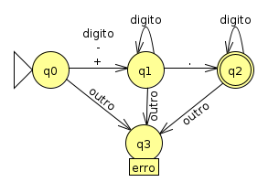
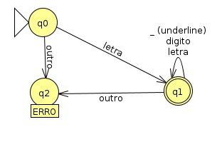

# **Implementação de um Compilador para a linguagem T++: Análise Léxica**

### **Caio L. A. Miglioli**

### Departamento de Computação - Universidade Técnologica Federal do Paraná, Campus Campo Mourão.

### caiomiglioli@gmail.com

***Resumo.*** Para se desenvolver um compilador, é preciso implementar quatro partes cruciais. Este trabalho tem como objetivo documentar o desenvolvimento da primeira parte, a análise léxica. Na análise léxica, sujeitamos um arquivo de código fonte da linguagem T++ à um script escrito em python utilizando a biblioteca PLY (Python Lex-Yacc) a fim de identificar palavras e associá-las a tokens léxicos. E para a identificação de tais palavras, utilizamos expressões regulares e autômatos finitos.


## **1. Introdução**
O processo de implementação de um compilador para uma linguagem pode ser divida em quatro grandes partes: A análise léxica, a análise sintática, a análise semântica e a geração de código. Cada uma dessas partes possuem teorias complexas e distintas para que se resolvam os problemas levantados.

Na análise léxica, buscamos dar sentido à cada palavra e simbolo encontrado no código de origem através da associação com tokens de referência. Tais tokens serão utilizados futuramente para identificar regras sintáticas em uma outra parte da implementação.

Mas para identificar o que é uma palavra ou simbolo aceito pela linguagem, devemos submeter cada cadeia de caracteres encontrada à uma bateria de testes. Tais testes são na verdade algumas expressões regulares, onde cada expressão se refere a um token, e cada token possui um significado distinto. Uma palavra é considerada aceita pela linguagem quando é possível associá-la a um token.

## **2. A linguagem T++**
A linguagem T++ é uma evolução e tradução da Tiny, uma linguagem construida para fins didáticos e utilizada no livro *"Compiladores: princípios e práticas"* de Kenneth C. Louden.

O T++ possui suporte à números inteiros, flutuantes e notação científica, e a vetores destes tipos de dados. Possui suporte à funções e laços, operadores de atribuição, soma, subtração, divisão, multiplicação, e também a operadores lógicos. 

```
inteiro: n
n := 10
inteiro: a[n]

inteiro insertionSort(inteiro: vet[], inteiro: tam)
    inteiro: i
    inteiro: chave
    inteiro: j

    i := 1
    repita
        chave := vet[i]
        j := i - 1

        repita
            vet[j+1] := vet[j]
            j := j-1     
        até j>=0 && vet[j] > chave 

        vet[j+1] = chave
            
        i := i+1
    até i < n
fim
```
**Código 1:** Exemplo de código em T++.


## **3. Implementação**
### **3.1. PLY**
Para a implementação, foi utilizado o PLY (Python Lex-Yacc), uma biblioteca para Python desenvolvida por Dabeaz, na qual implementa ferramentas de análise léxica e sintática baseadas nas ferraments FLex e Yacc do C.

Para a análise léxica, o PLY utiliza de uma definição parecida com o FLex, onde se define primeiramente os Tokens, depois associa-se expressões regulares a cada Token, e por fim cria-se funções para lidar com tokens que necessitam de um tratamento mais complexo.

```
{definições}
%%
{regras}
%%
{rotinas auxiliares}
```
**Código 2:** Formato de um arquivo de entrada FLex

### **3.2. Definição dos Tokens**
Para definir os tokens, precisamos pensar previamente na sintaxe da linguagem que estamos escrevendo, pois precisamos lidar com ambiguidades e precedencias.

O conjunto final de tokens é uma soma de dois conjuntos, o conjunto dos simbolos e palavras aceitas, e o conjunto das palavras reservadas.

Nas tabelas 1 e 2 podemos ver os tokens definidos para a linguagem T++.

| Token | Símbolo/Palavra |
|-------|-----------------|
|ID | conjunto de palavras |
| NUM_NOTACAO_CIENTIFICA | ponto flutuante em notaçao científica |
| NUM_PONTO_FLUTUANTE | ponto flutuate |
| NUM_INTEIRO | inteiro |
| MAIS | + |
| MENOS | - |
| MULTIPLICACAO | * |
| DIVISAO | / |
| E_LOGICO | && |
| OU_LOGICO | \|\| |
| DIFERENCA | <>
| MENOR_IGUAL | <=
| MAIOR_IGUAL | >=
| MENOR | <
| MAIOR | >
| IGUAL | =
| NEGACAO | !
| ABRE_PARENTESE | (
| FECHA_PARENTESE | )
| ABRE_COLCHETE | [
| FECHA_COLCHETE | ]
| VIRGULA | ,
| DOIS_PONTOS | :
| ATRIBUICAO | :=
| COMENTARIO | {***}

**Tabela 1:** Tokens de simbolos e palavras aceitas.


| Token | Símbolo/Palavra |
|-------|-----------------|
| SE | se
| ENTAO | então 
| SENAO | senão 
| FIM | fim 
| REPITA | repita
| FLUTUANTE | flutuante 
| RETORNA | retorna
| ATE | até
| LEIA | leia
| ESCREVA | escreva 
| INTEIRO | inteiro 

**Tabela 2:** Tokens para as palavras reservadas.

### **3.3 Expressões Regulares e Autômatos Finitos**
Para que o PLY encontre as palavras e associem-as com o token correspondente, precisamos identificar quais são as regras correspondentes. Fazemos isso através do uso de expressões regulares.

No PLY devemos utilizar o prefixo "t_" e o nome exato do token em uma variável e realizar uma atribuição utilizando uma string compativel com o módulo "re" do python.

```
# Operadores Lógicos.
t_E_LOGICO = r'&&'
t_OU_LOGICO = r'\|\|'
t_NEGACAO = r'!'
```
**Código 3:** Exemplo de atribuição de Expressão Regular à um Token.

A maioria dos Tokens possuem regras triviais, como é o caso das palavras reservadas, símbolos únicos e de alguns símbolos aninhados como mostrado no código 3. Mas para que o lexador possa analisar todo o código, no final, por baixo dos panos, todas essas expressões regulares se tornarão um único autômato finito extremamente complexo, o que faz com que ferramentas como FLex e PLY sejam necessárias.

Na Tabela 3 está listado todas as expressões regulares utilizadas no projeto, com excessão do Identificador e do número flutuante, que será comentado com mais detalhes.


| Token | Expressão Regular |
|-------|-----------------|
| NUM_INTEIRO | \d+
| NUM_NOTACAO_CIENTIFICA | (([-\\+]?)([1-9])\\.([0-9])+\[eE\]([-\\+]?)([0-9]+)) |
| SE |  se
| ENTAO | então 
| SENAO | senão 
| RETORNA | retorna 
| FIM | fim 
| INTEIRO | inteiro
| FLUTUANTE | flutuante
| REPITA | repita
| ATE | ate
| LEIA | leia
| ESCREVA | escreva
|MAIS | \\+
|MENOS | - 
|VEZES | \\*
|DIVIDE | /
|ABRE_PARENTESE | \\(
|FECHA_PARENTESE | \\)
|ABRE_COLCHETE | \\[
|FECHA_COLCHETE | \\]
|VIRGULA | ,
|ATRIBUICAO |:=
|DOIS_PONTOS | :
|E | &&
|OU | \\|\\|
|NAO | !
|DIFERENTE  |<>
|MENOR_IGUAL | <=
|MAIOR_IGUAL | >=
|MENOR | <
|MAIOR | >
|IGUAL | =

**Tabela 3:** Regras de associação dos Tokens através de Expressões Regulares.

Há algumas expressões mais complexas que vale a pena entrar em mais detalhes, como a de ponto flutuante e identificador.

- **Expressão regular para número flutuante:**

O número flutuante consiste em um sinal opcional, um número inteiro, um ponto e mais números inteiros.
Definindo "digito" como a expressão "[0-9]+", ou seja, no mínimo um caractere entre 0 e 9, podemos facilitar a construção do autômato final mostrado na figura 1.



**Figura 1:** Autômato finito para a número flutuante.

- **Expressão regular para identificador:**

Já o identificador é um pouco mais complexo, pois sofre ambiguidade com as palavras reservadas, necessitanto assim de uma função de apoio. A função de apoio está descrita no código 5.

Uma palavra é considerada um Identificador quando esta é aceita pela expressão regular exibida no código 4 (e exibida em forma de autômato na Figura 2) e não faz parte do conjunto de palavras reservadas.

```
digito = r"([0-9])"
letra = r"([a-zA-ZáÁãÃàÀéÉíÍóÓõÕ])"

id = (
    r"(" + letra + r"(" + digito + r"+|_|" + letra + r")*)"
)  # o mesmo que '((letra)(letra|_|([0-9]))*)'
```
**Código 4:** Expressão regular para Identificador.



**Figura 2:** Autômato finito para Identificador.


```
@TOKEN(id)
def t_ID(token):
    token.type = reserved_words.get(
        token.value, "ID"
    )  # não é necessário fazer regras/regex para cada palavra reservada
    # se o token não for uma palavra reservada automaticamente é um id
    # As palavras reservadas têm precedências sobre os ids

    return token
```
**Código 5:** Função de desambiguação de Identificadores e Palavras Reservadas.


## **Execução**

Para que executar o lexador desenvolvido, é necessário ter instalado na máquina qualquer versão do Python acima de 2.6. Em seguida, precisamos executar o script 'lex.py' alimentando-o com um arquivo de código fonte escrito em T++. O comando necessário está ilustrado no código 6.

```
python caminho/pro/arquivo/lex.py caminho/pro/codigotpp/codigo.tpp
```
**Código 6:** Comando de execução do script lexador.

E por fim, ao executar o código de exemplo em T++ exibido no código 7, temos como saída todos os tokens identificados pelo lexador, incluindo erros os encontrados juntamente com a linha e coluna. A saída pode ser vista no código 8.

```
inteiro: a
inteiro: b
inteiro: c

inteiro principal()
  a := 1
  b := 2
  $
  c := a + b
  escreva(c)
  retorna(0)
fim
```
**Código 7:** Código de exemplo em T++.

```
INTEIRO
DOIS_PONTOS
ID
INTEIRO
DOIS_PONTOS
ID
INTEIRO
DOIS_PONTOS
ID
INTEIRO
ID
ABRE_PARENTESE
FECHA_PARENTESE
ID
ATRIBUICAO
NUM_INTEIRO
ID
ATRIBUICAO
NUM_INTEIRO
[8, 3] Caracter inválido '$'
ID
ATRIBUICAO
ID
MAIS
ID
ESCREVA
ABRE_PARENTESE
ID
FECHA_PARENTESE
RETORNA
ABRE_PARENTESE
NUM_INTEIRO
FECHA_PARENTESE
FIM
```
**Código 8:** Saída gerada para o código de exemplo em T++ exibido no código 7.


## **Conclusão**
Muitos conhecimentos soam abstratos quando se é estudado sem o uso como objetivo. Autômatos finitos e expressões regulares, tendo sua teoria sido desenvolvida muito antes da computação, parecia ser algo que na prática não possuia serventia, mas ao desenvolver um lexador, fica claro o quanto tais estudos revolucionaram o mundo. Sem tais conhecimentos, não haveriam linguagens eficientes de programação em alto nível.

A análise léxica tem uma das mais importantes funções na criação de um compilador para uma linguagem de alto nível, pois é aqui que é criado toda a base para que se possa dar sentido a um código. Uma identificação de palavras eficiente, desenvolvida através dos assuntos estudados anteriormente, é um fator crucial para que se possa criar uma ponte entre linguagem de máquina e uma linguagem compreensível para o ser humano.


## **Referências**

**Beazley, D. (2007).** Ply (python lex-yacc).

**Beazley, D. (2007).** Writing parsers and compilers with PLY.

**Louden, K. C. (2004).** In Learning, C. editor, Compiladores: princípios e práticas. 1th edition.